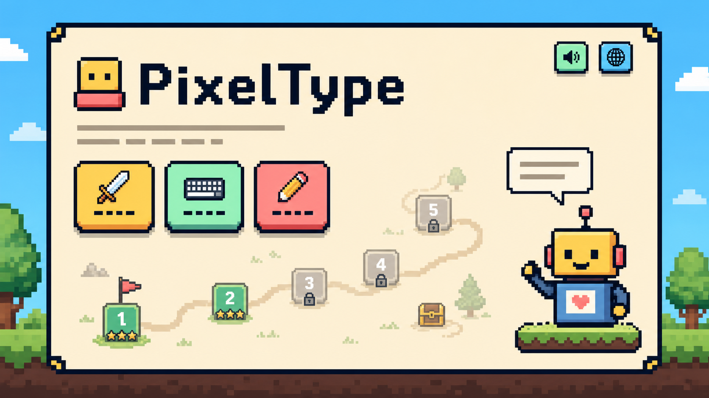

<p align="center">
  
</p>

<h1 align="center">PixelType</h1>

<p align="center">A local browser typing game for primary school students</p>

<p align="center">
  <a href="README.md">简体中文</a> · <strong>English</strong>
</p>

<p align="center">
  
  
  
  
  <a href="LICENSE"></a>
</p>

<p align="center">
  
</p>

PixelType uses a pixel-art adventure map, free practice, and typing mini-games to help primary school students build English keyboard skills step by step. The interface opens in Chinese by default and can be switched to English at any time. No account, backend service, or internet connection is required, and progress is stored in the current browser.

## User Manual

### Requirements

- A computer with a physical keyboard.
- The latest version of Chrome or Edge is recommended.
- Playing the game does not require Node.js or an internet connection.

### Running the Game

1. Download and extract the project, or clone the repository locally.
2. Open the project root directory.
3. Double-click `index.html` to launch the game in your default browser.

If no system voice is available in the browser, the game will still work normally, but the guide will not read its messages aloud.

### Current Game Modes

#### Adventure Map

The adventure map contains eight progressive levels. It starts with `F` and `J` index-finger positioning, then introduces the home row, top row, bottom row, English words, and simple sentences.

- Read or listen to the guide before each level begins.
- Type the target shown on screen with a physical keyboard.
- Correct characters receive immediate feedback, while mistakes are recorded and highlighted.
- Finish a level to earn stars based on accuracy and speed and unlock the next level.

#### Free Practice

Free practice does not change adventure-map stars or unlock progress. It offers:

- Letter practice
- Word practice
- Sentence practice
- Mixed practice

#### Letter Rain

Choose low or high speed and type the letter shown inside each falling raindrop. The game ends after five drops are missed and then displays survival time and cleared-drop statistics.

#### Countdown Defuse

Type the full English sentence before the bomb timer reaches zero. Capitalization, spaces, and punctuation must all be correct. Completing a sentence starts the next round, with the available time adjusted to the sentence length.

### Common Controls

- The sound button in the upper-right corner controls guide speech, typing feedback, and game ambience.
- The language button switches between the Chinese and English interfaces.
- Adventure progress, language, and sound preferences are saved automatically in the current browser.
- Clearing the site's local browser data also removes saved game progress.

## Developer Guide

### Technology Stack

- HTML5
- CSS3, Grid, Flexbox, responsive layouts, and CSS animations
- Vanilla JavaScript
- Web Audio API, Web Speech API, Local Storage, and `requestAnimationFrame`
- Node.js ES Module development scripts
- The built-in Node.js test runner, `node:test`

The runtime has no third-party dependencies and uses no frontend framework, bundler, backend service, or database.

### Directory Structure

```text
PixelType/
├── assets/
│   ├── reference/                  # README and visual reference images
│   └── sprites/                    # Pixel-art game sprites
│       └── font/                   # A-Z / a-z pixel letters
├── scripts/
│   ├── generate-font-sprites.mjs   # Generates pixel letter assets
│   ├── generate-home-sprites.mjs   # Generates home and game sprites
│   └── optimize-png-assets.mjs     # Optimizes PNG files
├── src/
│   ├── app.js                      # Rendering, state, and main flow
│   ├── bomb-audio-engine.browser.js
│   ├── feedback-audio-engine.browser.js
│   ├── free-practice.browser.js
│   ├── free-practice.js
│   ├── game-modes.browser.js
│   ├── i18n.js
│   ├── levels.js
│   ├── mission-intro.js
│   ├── rain-audio-engine.browser.js
│   ├── storage.js
│   └── typing-engine.js
├── tests/                          # Node.js automated tests
├── font-review.html                # Pixel-font review page
├── index.html                      # Game entry point
├── package.json                    # Project metadata and scripts
├── styles.css                      # Global UI and animation styles
├── README.md                       # Default Chinese documentation
└── README.en.md                    # English documentation
```

### File Reference

#### Pages and Data

| File | Purpose |
| --- | --- |
| `index.html` | Static entry point that loads the styles and browser scripts. |
| `styles.css` | Home, level, free-practice, mini-game, pixel-animation, and responsive styles. |
| `src/app.js` | Page rendering, global state, keyboard events, and mode navigation. |
| `src/levels.js` | Targets, prompts, and scoring configuration for the eight adventure levels. |
| `src/i18n.js` | Chinese and English interface copy. |
| `src/storage.js` | Browser-local progress and preference storage. |
| `src/mission-intro.js` | Mission introductions, speech state, and input activation timing. |

#### Typing and Game Modes

| File | Purpose |
| --- | --- |
| `src/typing-engine.js` | Adventure-mode input validation, statistics, and results. |
| `src/free-practice.js` | Testable free-practice task generation. |
| `src/free-practice.browser.js` | Browser-facing free-practice mode data and interface. |
| `src/game-modes.browser.js` | Browser state engines for Letter Rain and Countdown Defuse. |

#### Audio

| File | Purpose |
| --- | --- |
| `src/feedback-audio-engine.browser.js` | Correct, incorrect, and regular key feedback. |
| `src/rain-audio-engine.browser.js` | Letter Rain ambience and landing sounds. |
| `src/bomb-audio-engine.browser.js` | Countdown Defuse music and explosion sound. |

#### Assets and Tests

| Path | Purpose |
| --- | --- |
| `assets/sprites/` | Home, character, button, icon, raindrop, bomb, and pixel-font assets. |
| `assets/reference/` | Project showcase and visual reference images. |
| `scripts/` | Sprite generation and PNG optimization scripts used during development only. |
| `tests/` | Tests for typing logic, storage, UI copy, audio engines, and assets. |

### Development Commands

Node.js is not required to play the game. Install it only when generating assets, optimizing images, or running tests.

```bash
# Run the full automated test suite
npm test

# Regenerate the font and home-page sprites
npm run generate:sprites

# Optimize PNG assets
npm run optimize:assets
```

All code and assets in this project are released under the [MIT License](LICENSE).
